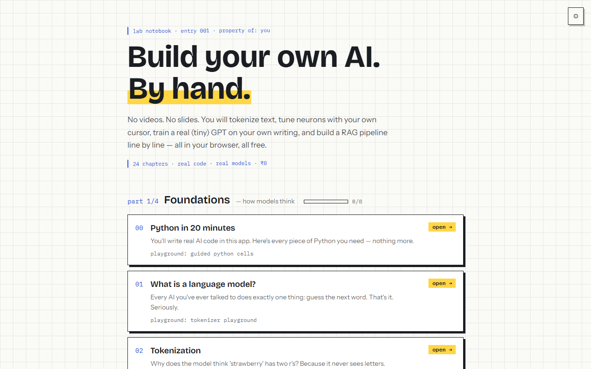
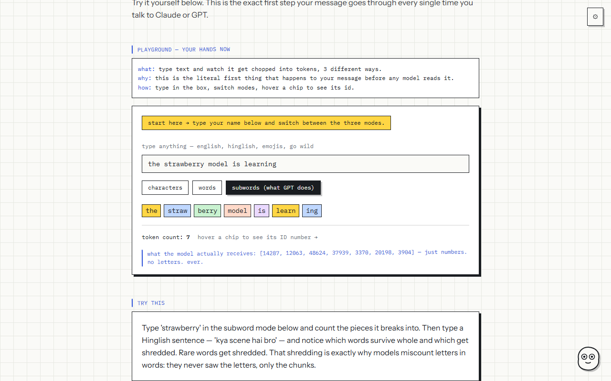
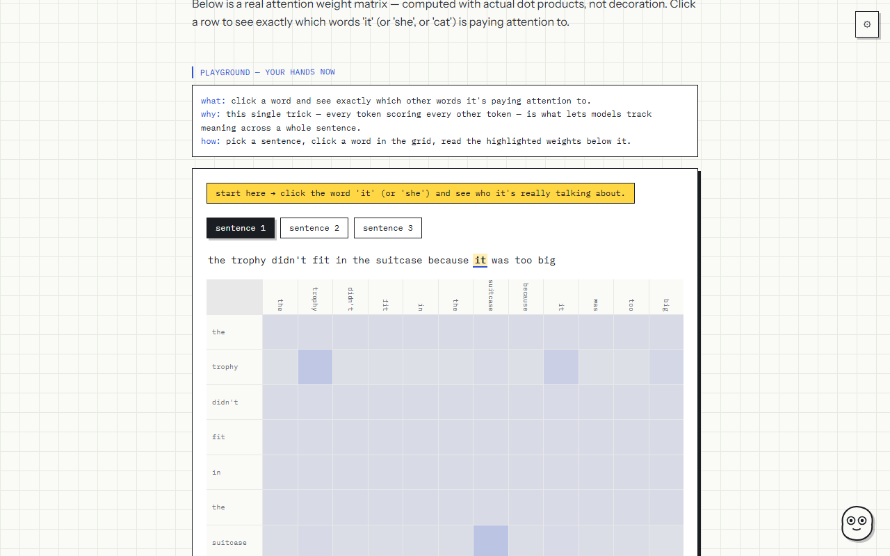
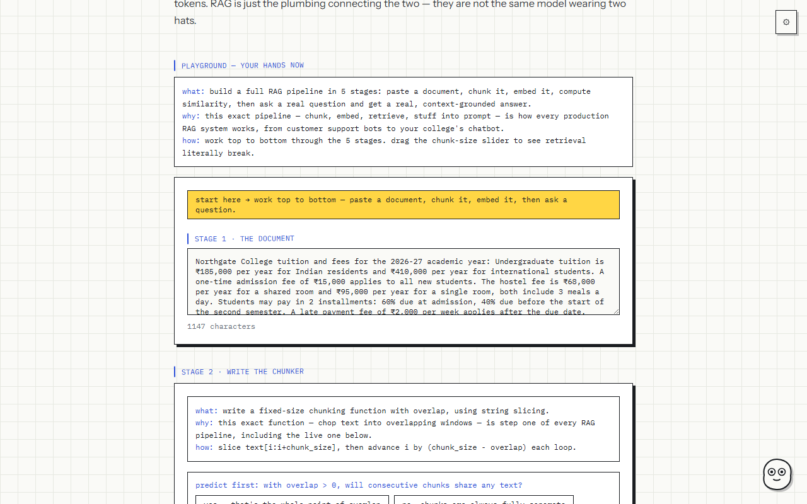

<div align="center">

# 🔬 LLM Lab

### build your own AI — by hand

**An interactive lab that teaches how LLMs actually work by making you build every piece yourself.**
Real Python in your browser. A tiny GPT you train live. A RAG pipeline you write line by line.

[](https://buildyourownai.vercel.app)
[](https://nextjs.org)
[](https://pyodide.org)
[](#)

**24 chapters · 4 boss levels · 0 videos · 0 rupees**

**→ [buildyourownai.vercel.app](https://buildyourownai.vercel.app)**

</div>

---

<!-- 📸 drop a gif of ch9 training live here — best 5 seconds of the whole app -->
<!--  -->

## 🧠 The idea

Every AI course shows you a black box and describes what's inside.
**LLM Lab hands you a glass box and a screwdriver.**

| Typical course | LLM Lab |
|---|---|
| Watch a video about attention | Type a sentence, watch a real attention head compute a heatmap on *your* words |
| "Training minimizes loss" | Paste your own writing, train a char-level model live, watch gibberish become your style |
| RAG explained with a diagram | You write the chunking function and cosine similarity — then watch *your code* retrieve real chunks |
| Multiple-choice quiz at the end | Predict-before-you-run, break-it challenges, boss levels with planted bugs to hunt |

---

## ✨ What's inside

🧪 **Pip, the lab companion** — a doodle mascot who tracks your cursor, notices when you're stuck (same error twice? idle too long?) and quietly offers to explain. Never naggy — the cooldown doubles every time you wave it off.

🎚️ **4 difficulty layers on every exercise** — fill-in-the-blank → arrange-the-blocks → write-with-hints → freehand. Never written code before? Still works.

🌱 **"Explain with example" toggle** — any concept, re-explained through everyday analogies. Tokenization = tearing a roti into bite-size pieces.

💡 **Click book** — tap "that clicked" on any moment it lands. Your journey becomes a personal list of lightbulbs.

👾 **Boss levels** — each part ends with a broken pipeline and planted bugs you have to diagnose. Debugging is the deepest form of understanding.

🛠️ **The Build Path** — after the chapters, an 8-stage checklist that walks you from "pick a project" to "ship it and write it up."

---

## 🗺️ The journey

<table>
<tr><td width="26%">

**Part 1 · Foundations**
`how models think`

</td><td>

tokenization · embeddings · neural nets · attention · positional encoding · the transformer block

</td></tr>
<tr><td>

**Part 2 · Training**
`how models learn`

</td><td>

loss · backprop & gradient descent · **the live training loop ★** · pretraining vs finetuning · RLHF

</td></tr>
<tr><td>

**Part 3 · Using models**
`where the jobs are`

</td><td>

sampling & temperature · prompting · context windows & KV cache · **RAG, built by hand ★** · vector databases · agents & tool use · LoRA

</td></tr>
<tr><td>

**Part 4 · Reality check**
`limits & what's next`

</td><td>

hallucination · prompt injection · evals · scaling & quantization · capstone · a 12-week PyTorch roadmap

</td></tr>
</table>

Every chapter follows the same rhythm: **hook → concept → playground → break-it challenge → checkpoint → recap card.**
Finish them all and your recap deck doubles as an interview-prep flashcard set.

---

## 📸 Screenshots

| | |
|---|---|
| <br>*the journey map* | <br>*ch1 — live tokenizer* |
| <br>*ch5 — attention heatmap* | <br>*ch15 — the RAG pipeline* |

---

## 🚀 Run it locally

```bash
git clone https://github.com/harshikabodekar/llm-lab.git
cd llm-lab
npm install
npm run dev
```

→ [localhost:3000](http://localhost:3000). Start at **chapter 0** if you've never written Python, **chapter 1** otherwise.

> **Optional:** add a free [Gemini API key](https://aistudio.google.com) via ⚙️ settings to unlock the prompting lab, the live agent, and Pip's explanations. Everything else — all 24 chapters, the training loop, RAG retrieval, every code cell — runs fully in your browser. Your key stays in your own browser, never sent anywhere.

---

## 🛠️ Built with

**Next.js 14** (App Router) · **Tailwind** · **Pyodide** (real Python + NumPy in the browser) · **Transformers.js** (real embedding models, locally) · **Gemini API** (free tier, bring-your-own-key)

And **`engine/tinynn.js`** — a hand-written neural network library: forward pass, backprop, softmax, zero dependencies. Every weight and gradient is exposed so the UI can show you *inside* the model while it learns. Each function maps 1:1 to its PyTorch equivalent, which the final chapter uses to teach PyTorch by comparison.

**Design:** a graph-paper lab notebook — blue-ink margin notes, highlighter accents, taped-in paper cards. You're not watching a course. You're working through a notebook.

---

## 🎯 What you walk away with

✅ Explain every layer of an LLM from real understanding, not memorized definitions
✅ A RAG system and an agent loop you built yourself, piece by piece
✅ Intuition for the dials that matter — temperature, learning rate, chunk size, context limits
✅ The judgment to debug AI products: *why* it hallucinated, *why* retrieval failed
✅ A concrete 12-week roadmap from here to training real models on real GPUs

✅ And an honest list of what this **can't** teach you — because any course promising you'll rebuild GPT-4 solo is lying.

---

<div align="center">

Built by **[Harshika Bodekar](https://github.com/harshikabodekar)**
frontend developer turned AI engineer — building the resource she wished existed

*Powered by Pyodide, Transformers.js & stubbornness.*

</div>
